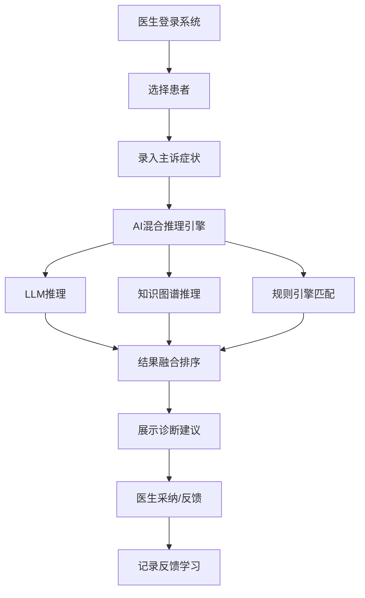
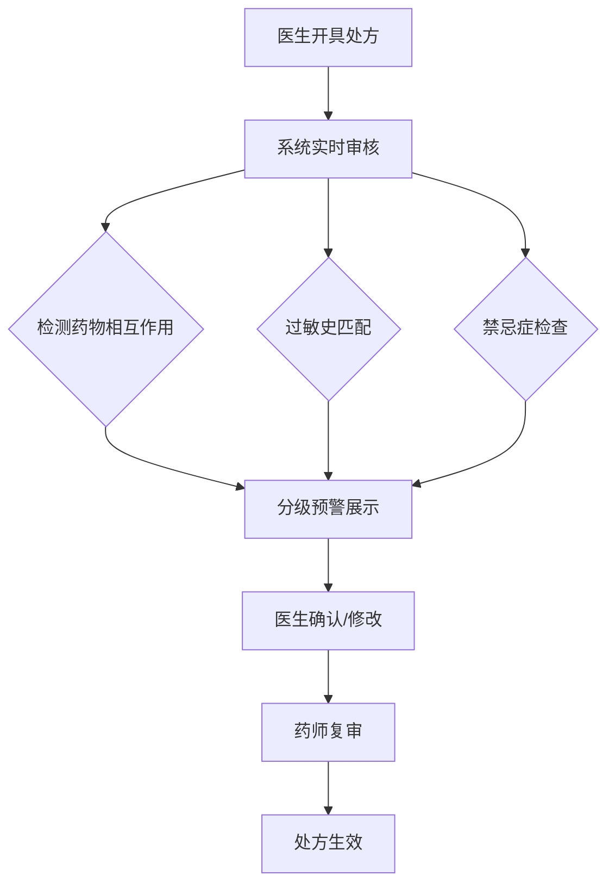

## 1. 产品概述

智慧医疗临床决策支持系统（CDSS）是一款基于人工智能技术的专业级医疗辅助诊疗平台，整合医学知识库、知识图谱推理、大语言模型理解能力，为临床医生提供实时、精准、智能化的诊断、用药、检查、治疗全流程决策支持。

- 面向医疗机构临床医生、药师、质控人员，解决诊断准确率低、用药差错、病历质量不达标等核心痛点
- 目标实现Top3诊断准确率≥95%、用药错误拦截率≥99%、单次决策响应≤3秒

## 2. 核心功能

### 2.1 用户角色

| 角色 | 注册方式 | 核心权限 |
|------|----------|----------|
| 临床医生 | 管理员分配账号 | 诊断辅助、用药审核、检查解读、治疗推荐、病历质控 |
| 药师 | 管理员分配账号 | 用药审核、药物相互作用检测、配伍禁忌检查 |
| 质控人员 | 管理员分配账号 | 病历质控、质量评分、统计分析 |
| 科研人员 | 管理员分配账号 | 病例检索、数据分析、队列管理 |
| 系统管理员 | 系统初始化 | 用户管理、知识库管理、系统配置、审计日志 |

### 2.2 功能模块

1. **工作台首页**：数据概览、今日待办、预警提醒、快捷入口、实时统计
2. **患者管理**：患者列表、患者详情、就诊记录、历史病历
3. **智能诊断辅助**：症状录入、AI诊断建议、鉴别诊断、置信度排序、循证依据
4. **用药决策支持**：处方审核、药物相互作用、过敏提醒、剂量计算、禁忌症检查
5. **检查检验辅助**：检查推荐、结果解读、异常分析、危急值预警、趋势分析
6. **治疗方案推荐**：指南匹配、个体化治疗、临床路径、随访计划
7. **病历质控引擎**：完整性检查、时限监控、术语标准化、逻辑校验、质控评分
8. **知识库管理**：疾病知识、药品知识、临床指南、医学术语、知识检索

### 2.3 页面详情

| 页面名称 | 模块名称 | 功能描述 |
|----------|----------|----------|
| 登录页 | 用户认证 | 账号密码登录、记住登录、安全验证 |
| 工作台首页 | 数据概览 | 今日接诊数、待审核数、预警数、AI辅助次数统计卡片 |
| 工作台首页 | 预警提醒 | 用药预警、危急值预警、病历超期提醒实时列表 |
| 工作台首页 | 快捷入口 | 诊断辅助、用药审核、检查解读、知识检索快速入口 |
| 患者管理 | 患者列表 | 搜索筛选、分页浏览、状态标签、快速查看 |
| 患者管理 | 患者详情 | 基本信息、就诊历史、诊断记录、用药记录、检查检验 |
| 智能诊断 | 症状录入 | 主诉输入、症状选择、病史录入、体格检查 |
| 智能诊断 | 诊断结果 | AI诊断建议列表、置信度、ICD-10编码、循证依据、采纳/反馈 |
| 用药决策 | 处方审核 | 药物相互作用检测、过敏检查、禁忌症检查、剂量建议 |
| 用药决策 | 预警列表 | 分级预警（禁忌/严重/警告/注意）、预警详情、处理建议 |
| 检查检验 | 结果解读 | 异常指标高亮、临床意义分析、趋势图表、危急值标识 |
| 治疗方案 | 方案推荐 | 指南匹配方案、个体化建议、临床路径、随访计划 |
| 病历质控 | 质控检查 | 实时质控提示、问题列表、质控评分、改进建议 |
| 知识库 | 知识检索 | 全文检索、分类浏览、知识详情、关联推荐 |

## 3. 核心流程

### 3.1 诊断辅助流程

医生登录系统 → 选择/搜索患者 → 录入主诉和症状 → 系统AI混合推理 → 展示诊断建议列表（含置信度和循证依据）→ 医生查看详情 → 采纳/修改诊断 → 系统记录反馈

### 3.2 用药审核流程

医生开具处方 → 系统实时审核 → 检测药物相互作用/过敏/禁忌 → 分级预警展示 → 医生确认/修改 → 药师复审 → 处方生效

## 4. 用户界面设计

### 4.1 设计风格

- **主色调**：医疗蓝(#0EA5E9) + 深海蓝(#0369A1)，传达专业、可信、科技感
- **辅助色**：预警红(#EF4444)、警告橙(#F97316)、提示黄(#EAB308)、安全绿(#22C55E)
- **背景色**：浅灰白(#F8FAFC)为主背景，白色卡片，深色侧边栏(#0F172A)
- **字体**：思源黑体/Noto Sans SC，标题16-24px，正文14px，辅助12px
- **布局**：左侧固定导航栏 + 顶部工具栏 + 主内容区，卡片式布局
- **圆角**：卡片8px圆角，按钮6px圆角，输入框6px圆角
- **图标**：Lucide图标库，线性风格，2px描边
- **动效**：页面切换淡入，数据加载骨架屏，预警脉冲动画

### 4.2 页面设计概览

| 页面名称 | 模块名称 | UI元素 |
|----------|----------|--------|
| 登录页 | 登录表单 | 居中卡片、医疗Logo、渐变背景、输入框、登录按钮 |
| 工作台首页 | 数据概览 | 4个统计卡片(带图标和趋势箭头)、2个图表区域 |
| 工作台首页 | 预警列表 | 红橙黄蓝四级颜色标签、时间轴布局、脉冲动画 |
| 患者管理 | 患者列表 | 搜索栏、筛选标签、表格列表、分页器、状态徽章 |
| 智能诊断 | 症状录入 | 分步表单、症状标签选择器、文本域、提交按钮 |
| 智能诊断 | 诊断结果 | 置信度进度条、ICD编码标签、循证依据折叠面板 |
| 用药决策 | 处方审核 | 药物列表、预警卡片(颜色分级)、剂量计算器 |
| 检查检验 | 结果解读 | 指标表格(异常高亮)、趋势折线图、危急值横幅 |
| 知识库 | 知识检索 | 搜索框、分类标签、结果卡片列表、关联图谱 |

### 4.3 响应式设计

- 桌面优先设计，最小宽度1280px
- 侧边栏可折叠适配小屏
- 表格在小屏下转为卡片布局
- 图表自适应容器宽度

## 5. 非功能性需求

| 需求类型 | 指标 |
|----------|------|
| 性能 | 页面加载≤2秒，诊断响应≤3秒，用药审核≤1秒 |
| 安全 | TLS加密传输、AES-256存储加密、RBAC权限、审计日志 |
| 可用性 | SLA≥99.9%，支持1000并发用户 |
| 合规 | 符合等保三级、HIPAA、HL7 FHIR标准 |
