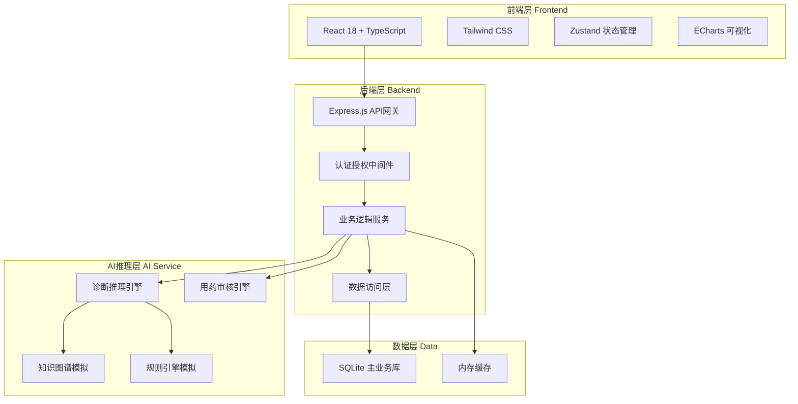
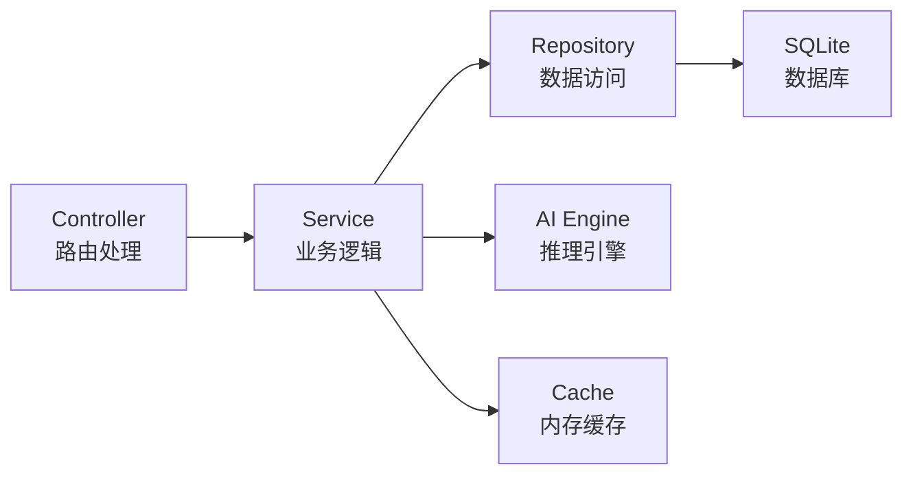
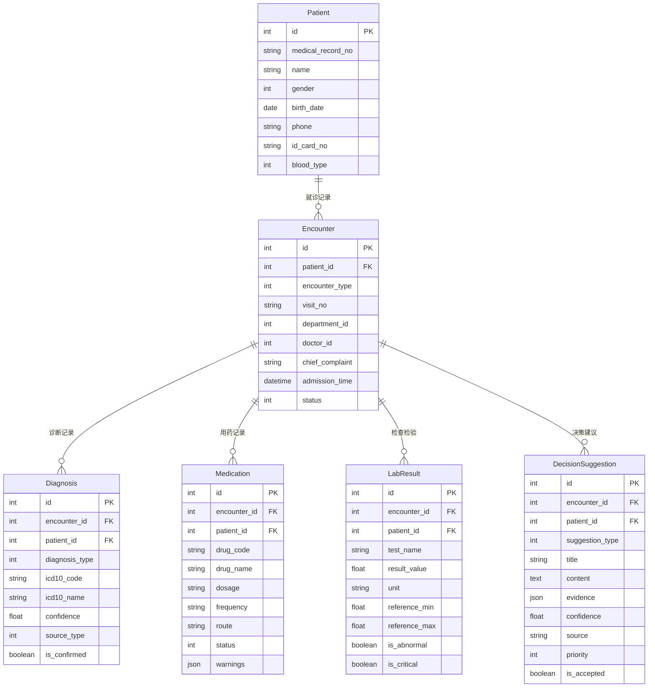

## 1. 架构设计



## 2. 技术说明

- **前端**: React@18 + TypeScript + Tailwind CSS@3 + Vite
- **初始化工具**: vite-init (react-express-ts 模板)
- **后端**: Express@4 + TypeScript
- **数据库**: SQLite (better-sqlite3)，开发阶段使用Mock数据
- **状态管理**: Zustand
- **可视化**: ECharts
- **图标**: lucide-react

## 3. 路由定义

| 路由 | 用途 |
|------|------|
| /login | 登录页面 |
| / | 工作台首页（数据概览） |
| /patients | 患者管理列表 |
| /patients/:id | 患者详情 |
| /diagnosis | 智能诊断辅助 |
| /diagnosis/:encounterId | 诊断结果详情 |
| /medication | 用药决策支持 |
| /lab-results | 检查检验辅助 |
| /treatment | 治疗方案推荐 |
| /quality-control | 病历质控引擎 |
| /knowledge | 知识库管理 |

## 4. API定义

### 4.1 认证API

```typescript
POST /api/auth/login
Request: { username: string; password: string }
Response: { token: string; user: UserInfo }

POST /api/auth/logout
Response: { success: boolean }

GET /api/auth/me
Response: UserInfo
```

### 4.2 患者API

```typescript
GET /api/patients?page=1&size=20&search=&department=
Response: { list: Patient[]; total: number }

GET /api/patients/:id
Response: PatientDetail

GET /api/patients/:id/encounters
Response: Encounter[]

GET /api/patients/:id/medications
Response: Medication[]
```

### 4.3 诊断API

```typescript
POST /api/diagnosis/suggest
Request: { patientId: number; symptoms: string[]; chiefComplaint: string; medicalHistory: string }
Response: DiagnosisSuggestion[]

POST /api/diagnosis/:suggestionId/accept
Response: { success: boolean }

POST /api/diagnosis/:suggestionId/feedback
Request: { accepted: boolean; comment: string }
Response: { success: boolean }
```

### 4.4 用药API

```typescript
POST /api/medication/check
Request: { patientId: number; medications: MedicationInput[] }
Response: MedicationWarning[]

GET /api/medication/interactions?drug1=&drug2=
Response: DrugInteraction[]
```

### 4.5 检查检验API

```typescript
GET /api/lab-results/:encounterId
Response: LabResult[]

POST /api/lab-results/interpret
Request: { results: LabResultInput[] }
Response: LabInterpretation[]
```

### 4.6 知识库API

```typescript
GET /api/knowledge/search?q=&type=&page=1&size=20
Response: { list: KnowledgeItem[]; total: number }

GET /api/knowledge/:id
Response: KnowledgeDetail
```

### 4.7 仪表盘API

```typescript
GET /api/dashboard/stats
Response: DashboardStats

GET /api/dashboard/alerts
Response: Alert[]

GET /api/dashboard/recent-encounters
Response: EncounterSummary[]
```

## 5. 服务端架构图



## 6. 数据模型

### 6.1 数据模型定义



### 6.2 数据定义语言

```sql
CREATE TABLE t_user (
    id INTEGER PRIMARY KEY AUTOINCREMENT,
    username VARCHAR(50) UNIQUE NOT NULL,
    password_hash VARCHAR(255) NOT NULL,
    name VARCHAR(100) NOT NULL,
    role VARCHAR(20) NOT NULL,
    department VARCHAR(100),
    phone VARCHAR(20),
    email VARCHAR(100),
    status INTEGER DEFAULT 1,
    created_at DATETIME DEFAULT CURRENT_TIMESTAMP,
    updated_at DATETIME DEFAULT CURRENT_TIMESTAMP
);

CREATE TABLE t_patient (
    id INTEGER PRIMARY KEY AUTOINCREMENT,
    medical_record_no VARCHAR(50) UNIQUE NOT NULL,
    name VARCHAR(100) NOT NULL,
    gender INTEGER NOT NULL,
    birth_date DATE NOT NULL,
    phone VARCHAR(20),
    id_card_no VARCHAR(18),
    blood_type INTEGER,
    address TEXT,
    allergies TEXT,
    created_at DATETIME DEFAULT CURRENT_TIMESTAMP,
    updated_at DATETIME DEFAULT CURRENT_TIMESTAMP
);

CREATE TABLE t_encounter (
    id INTEGER PRIMARY KEY AUTOINCREMENT,
    patient_id INTEGER NOT NULL,
    encounter_type INTEGER NOT NULL,
    visit_no VARCHAR(50) UNIQUE NOT NULL,
    department_id INTEGER,
    doctor_id INTEGER,
    chief_complaint TEXT,
    admission_time DATETIME,
    discharge_time DATETIME,
    status INTEGER DEFAULT 1,
    created_at DATETIME DEFAULT CURRENT_TIMESTAMP
);

CREATE TABLE t_diagnosis (
    id INTEGER PRIMARY KEY AUTOINCREMENT,
    encounter_id INTEGER NOT NULL,
    patient_id INTEGER NOT NULL,
    diagnosis_type INTEGER NOT NULL,
    icd10_code VARCHAR(20),
    icd10_name VARCHAR(200),
    diagnosis_desc TEXT,
    confidence REAL,
    source_type INTEGER,
    is_confirmed INTEGER DEFAULT 0,
    created_at DATETIME DEFAULT CURRENT_TIMESTAMP
);

CREATE TABLE t_medication (
    id INTEGER PRIMARY KEY AUTOINCREMENT,
    encounter_id INTEGER NOT NULL,
    patient_id INTEGER NOT NULL,
    drug_code VARCHAR(50),
    drug_name VARCHAR(200) NOT NULL,
    specification VARCHAR(100),
    dosage VARCHAR(50),
    frequency VARCHAR(50),
    route VARCHAR(50),
    status INTEGER DEFAULT 1,
    warnings TEXT,
    created_at DATETIME DEFAULT CURRENT_TIMESTAMP
);

CREATE TABLE t_lab_result (
    id INTEGER PRIMARY KEY AUTOINCREMENT,
    encounter_id INTEGER NOT NULL,
    patient_id INTEGER NOT NULL,
    test_name VARCHAR(200) NOT NULL,
    result_value REAL,
    unit VARCHAR(30),
    reference_min REAL,
    reference_max REAL,
    is_abnormal INTEGER DEFAULT 0,
    is_critical INTEGER DEFAULT 0,
    test_time DATETIME,
    created_at DATETIME DEFAULT CURRENT_TIMESTAMP
);

CREATE TABLE t_decision_suggestion (
    id INTEGER PRIMARY KEY AUTOINCREMENT,
    encounter_id INTEGER NOT NULL,
    patient_id INTEGER NOT NULL,
    suggestion_type INTEGER NOT NULL,
    title VARCHAR(200) NOT NULL,
    content TEXT NOT NULL,
    evidence TEXT,
    confidence REAL,
    source VARCHAR(50),
    priority INTEGER,
    is_accepted INTEGER,
    created_at DATETIME DEFAULT CURRENT_TIMESTAMP
);

CREATE TABLE t_knowledge (
    id INTEGER PRIMARY KEY AUTOINCREMENT,
    knowledge_type VARCHAR(50) NOT NULL,
    title VARCHAR(200) NOT NULL,
    content TEXT NOT NULL,
    keywords TEXT,
    icd10_codes TEXT,
    source VARCHAR(100),
    evidence_level INTEGER,
    created_at DATETIME DEFAULT CURRENT_TIMESTAMP,
    updated_at DATETIME DEFAULT CURRENT_TIMESTAMP
);
```
