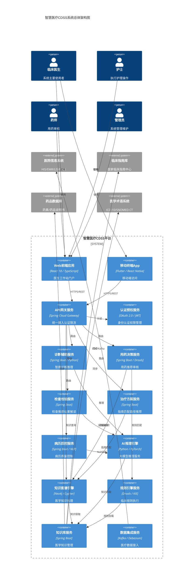
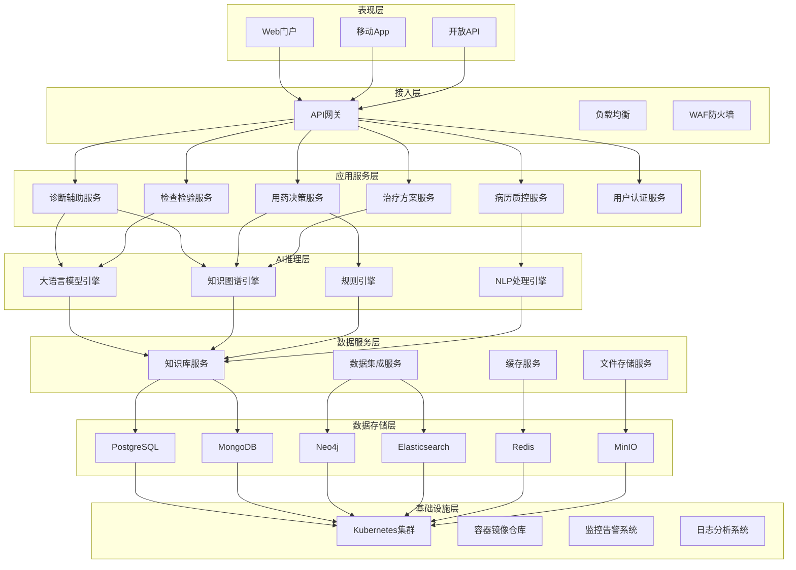
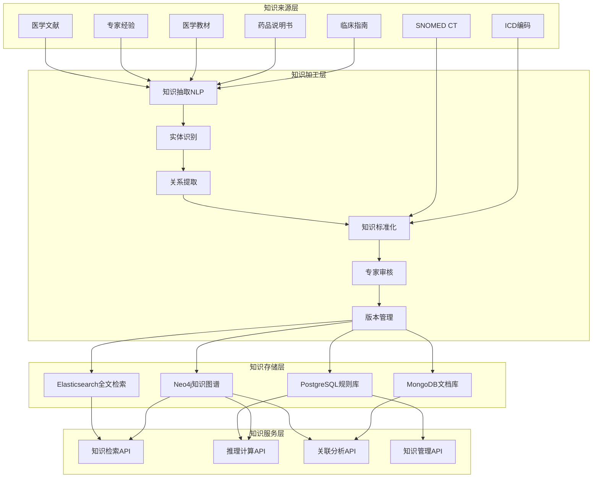
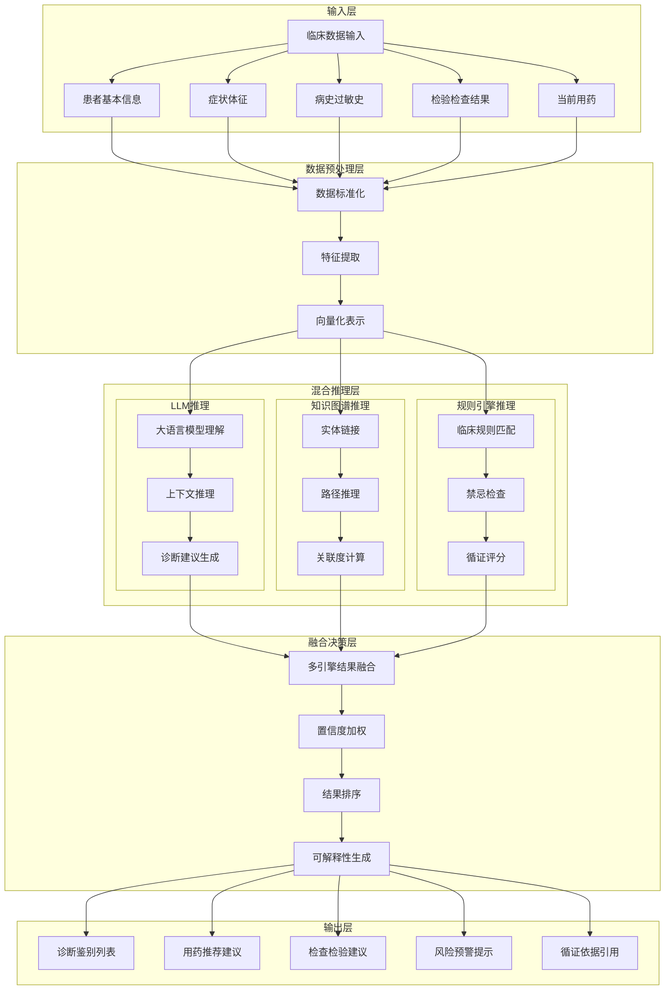
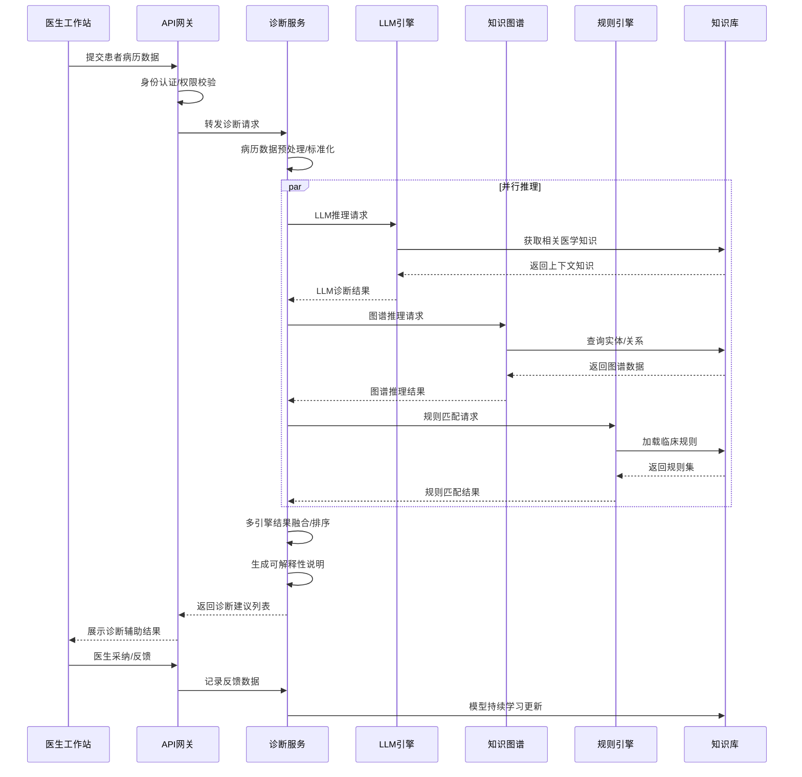
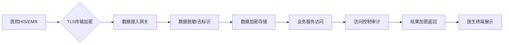
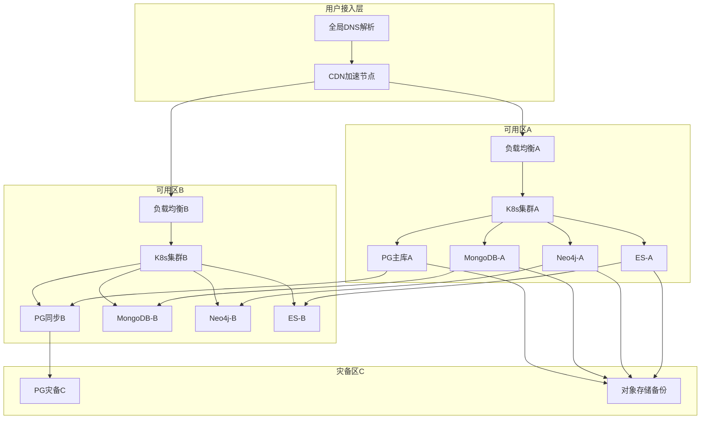
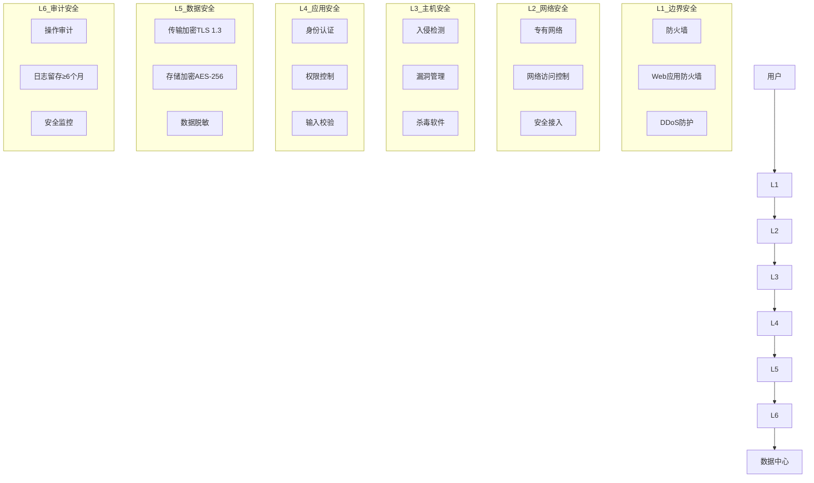
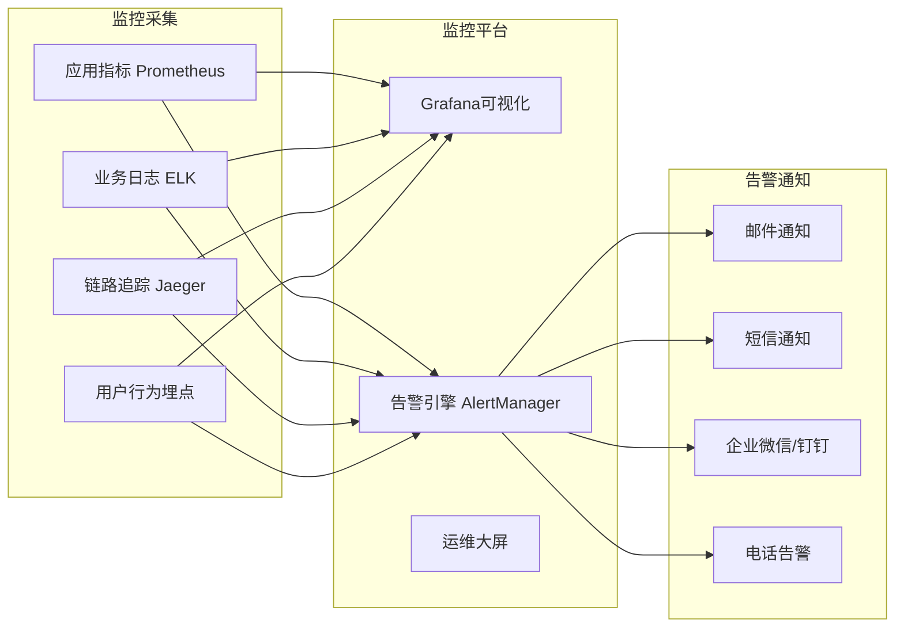

# 智慧医疗临床决策支持系统(CDSS) - 系统架构设计

**文档版本：** v1.0
**日期：** 2026年5月
**状态：** 正式版
**密级：** 内部机密

---

## 1. 概述

### 1.1 系统定位

智慧医疗临床决策支持系统（Clinical Decision Support System, CDSS）是一款基于人工智能技术的专业级医疗辅助诊疗平台。系统通过整合医学知识库、知识图谱推理、大语言模型理解能力，为临床医生提供实时、精准、智能化的诊断、用药、检查、治疗等全流程决策支持。

### 1.2 设计目标

| 目标维度 | 具体要求 |
|---------|---------|
| **医疗合规性** | 符合HIPAA、HL7 FHIR、DICOM、ISO 27001等国际医疗标准 |
| **诊断准确率** | Top3诊断准确率 ≥ 95%，用药建议采纳率 ≥ 90% |
| **系统可用性** | SLA ≥ 99.99%，年停机时间 ≤ 52分钟 |
| **响应性能** | 单次决策响应时间 ≤ 3秒，并发支持 ≥ 1000医生在线 |
| **数据安全性** | 医疗数据全链路加密，符合等保三级要求 |
| **可扩展性** | 支持百万级知识库条目，支持千级TPS扩展 |

### 1.3 参考标准

- HL7 FHIR R4 - 医疗数据交互标准
- DICOM 3.0 - 医学影像标准
- HIPAA - 美国健康保险可携性和责任法案
- ISO 27001 - 信息安全管理体系
- GB/T 22239 - 网络安全等级保护基本要求
- IHE - 医疗健康信息集成规范

---

## 2. 总体架构设计

### 2.1 系统总体架构图

### 2.2 分层架构设计

系统采用经典的七层架构设计，确保各层职责清晰、松耦合高内聚：

---

## 3. 核心模块架构

### 3.1 医疗知识库架构

### 3.2 AI混合推理引擎架构

---

## 4. 数据流设计

### 4.1 临床决策数据流程

### 4.2 医疗数据安全流向

---

## 5. 高可用与容灾架构

### 5.1 多可用区部署架构

### 5.2 容灾恢复指标

| 容灾级别 | RPO (数据丢失) | RTO (恢复时间) | 适用场景 |
|---------|---------------|---------------|---------|
| **同城容灾** | ≤ 5分钟 | ≤ 30分钟 | 单机房故障 |
| **异地容灾** | ≤ 30分钟 | ≤ 4小时 | 城市级灾难 |
| **数据备份** | ≤ 24小时 | ≤ 24小时 | 数据误删除 |

---

## 6. 安全架构设计

### 6.1 纵深防御体系

### 6.2 医疗数据隐私保护

| 数据类型 | 保护措施 |
|---------|---------|
| **患者身份信息** | 去标识化处理、假名化、数据脱敏 |
| **病历诊疗数据** | 字段级加密、访问审计、权限最小化 |
| **医学影像数据** | 传输加密、水印溯源、访问日志 |
| **药品敏感数据** | 加密存储、审批流程、操作留痕 |

---

## 7. 集成架构

### 7.1 医院系统集成标准

| 集成系统 | 集成标准 | 集成方式 |
|---------|---------|---------|
| **HIS (医院信息系统)** | HL7 v2.x / FHIR | WebService / REST |
| **EMR (电子病历)** | HL7 CDA / FHIR | 数据库CDC / API |
| **LIS (检验系统)** | HL7 v2.x / ASTM | MQ消息队列 |
| **PACS (影像系统)** | DICOM 3.0 | DICOM协议 / WADO |
| **EMR (合理用药)** | 定制接口 | REST API |

---

## 8. 性能与扩展性架构

### 8.1 性能指标设计

| 性能指标 | 目标值 |
|---------|-------|
| 页面加载时间 | ≤ 2秒 |
| 诊断决策响应时间 | ≤ 3秒 |
| 用药决策响应时间 | ≤ 1秒 |
| 系统并发用户数 | ≥ 1000人 |
| API接口TPS | ≥ 5000 |
| 知识库查询响应 | ≤ 100ms |

### 8.2 水平扩展架构

- **无状态服务**：Kubernetes自动伸缩，支持10倍以上扩展
- **有状态服务**：数据库读写分离、分库分表
- **缓存层**：Redis Cluster分布式缓存
- **消息队列**：Kafka分区扩展
- **AI推理**：GPU集群弹性伸缩

---

## 9. 监控与运维架构

### 9.1 可观测性体系

---

## 10. 架构演进路线

### 10.1 版本规划

| 版本 | 时间 | 核心能力 |
|-----|------|---------|
| **v1.0** | 第1季度 | 基础诊断、用药建议、知识库 |
| **v2.0** | 第2季度 | 知识图谱、病历质控、影像AI |
| **v3.0** | 第3季度 | 多模态融合、临床路径、科研平台 |
| **v4.0** | 第4季度 | 医院级平台、区域医疗协同、联邦学习 |

---

**文档审核：** 架构委员会
**下一文档：** 《技术设计方案.md》
