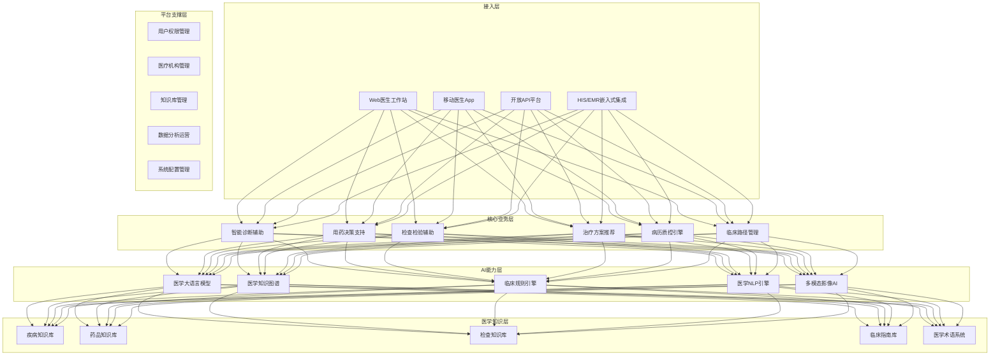
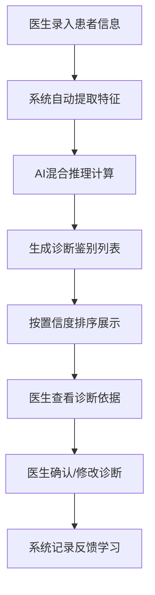
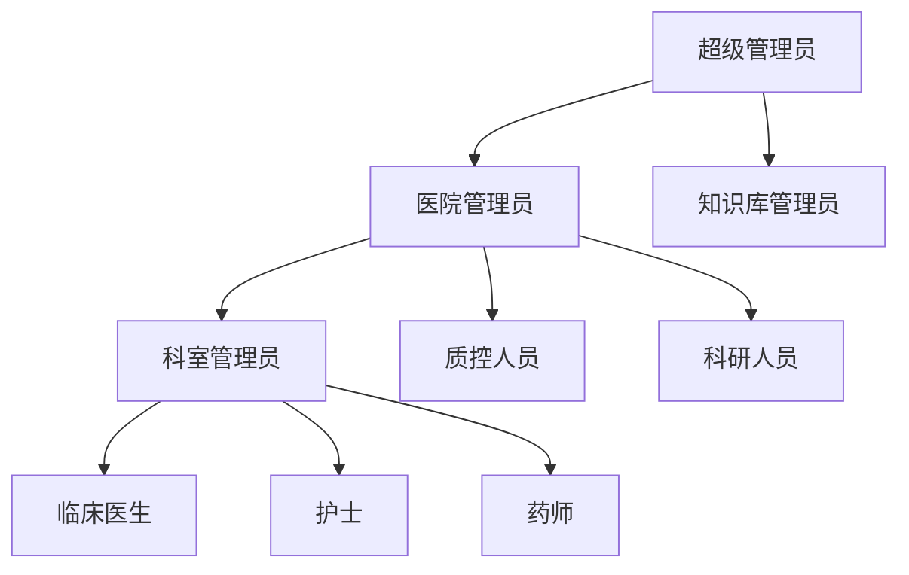

# 智慧医疗临床决策支持系统(CDSS) - 软件功能介绍

**产品版本：** v1.0
**发布日期：** 2026年5月
**产品定位：** AI辅助诊疗临床决策支持系统

---

## 1. 产品概述

### 1.1 产品定位

智慧医疗临床决策支持系统（CDSS）是一款基于人工智能技术的专业级医疗辅助诊疗平台，通过整合医学知识库、知识图谱推理、大语言模型理解能力，为临床医生提供**实时、精准、智能化**的诊断、用药、检查、治疗全流程决策支持。

### 1.2 核心价值

| 价值维度 | 核心价值点 |
|---------|-----------|
| **提升诊断准确率** | AI+知识图谱双引擎，Top3诊断准确率≥95% |
| **降低医疗差错** | 智能用药审核，减少药物不良反应风险 |
| **提高诊疗效率** | 辅助病历书写、自动推荐检查治疗方案 |
| **规范医疗行为** | 质控提醒、指南匹配，确保医疗质量 |
| **助力科研教学** | 真实世界数据，支持临床科研与教学 |

### 1.3 产品功能架构



---

## 2. 核心功能模块详解

### 2.1 智能诊断辅助

#### 功能概述

基于患者主诉、现病史、体格检查、检验检查结果，结合医学知识图谱和大语言模型推理，为医生提供智能诊断鉴别建议。

#### 核心功能

| 功能点 | 功能描述 |
|-------|---------|
| **症状鉴别诊断** | 根据患者症状体征智能生成鉴别诊断列表 |
| **疾病诊断建议** | 推荐最可能的疾病诊断，带ICD-10编码 |
| **并发症风险预警** | 识别潜在并发症风险，提前预警 |
| **重症识别提醒** | 自动识别急危重症，提醒医生优先处理 |
| **诊断依据溯源** | 每条诊断建议附带循证依据和文献来源 |

#### 功能界面流程



#### 诊断展示示例

| 序号 | 疾病名称 | ICD-10编码 | 置信度 | 诊断依据 |
|-----|---------|-----------|-------|---------|
| 1 | 急性上呼吸道感染 | J06.900 | 92% | 患者发热38.5℃、咽痛、鼻塞... |
| 2 | 急性扁桃体炎 | J03.900 | 78% | 扁桃体肿大Ⅱ度、咽部充血... |
| 3 | 流行性感冒 | J11.100 | 65% | 全身酸痛、乏力、流感季节... |

⚠️ **系统提示：仅供医生参考，不替代专业诊断**

---

### 2.2 用药决策支持

#### 功能概述

智能审核用药医嘱，提供药物相互作用、过敏反应、剂量计算、禁忌症检查，保障用药安全。

#### 核心功能

| 功能点 | 功能描述 |
|-------|---------|
| **药物相互作用检测** | 实时检测药物间相互作用，分级预警 |
| **过敏史提醒** | 自动匹配患者过敏史，禁用药提醒 |
| **剂量智能计算** | 根据年龄、体重、肝肾功能计算剂量 |
| **禁忌症检查** | 检查疾病与药物禁忌症 |
| **配伍禁忌提醒** | 静脉用药配伍禁忌检测 |
| **用药途径核查** | 确保给药途径合理 |
| **重复用药识别** | 识别同类药物重复使用 |
| **孕妇/哺乳期提醒** | 特殊人群用药警示 |
| **用药指南推荐** | 推荐最佳用药方案和疗程 |

#### 用药审核分级预警

| 预警级别 | 颜色 | 处理要求 | 示例 |
|---------|-----|---------|------|
| **禁忌** | 🔴 红色 | 禁止使用，强制提醒 | 青霉素过敏患者开具青霉素 |
| **严重** | 🟠 橙色 | 必须修改或说明理由 | 严重肾功能不全禁用药物 |
| **警告** | 🟡 黄色 | 建议调整，医生确认 | 两种药物存在相互作用 |
| **注意** | 🔵 蓝色 | 提示信息，无需确认 | 老年人剂量调整建议 |

---

### 2.3 检查检验辅助

#### 功能概述

智能推荐合理检查项目，自动解读检验检查结果，识别异常指标并提供临床意义分析。

#### 核心功能

| 功能点 | 功能描述 |
|-------|---------|
| **检查项目推荐** | 根据病情推荐必要检查，避免过度检查 |
| **检查必要性评估** | 评估已开检查的必要性，减少重复检查 |
| **检验结果解读** | 自动分析异常指标，解释临床意义 |
| **危急值预警** | 自动识别检验危急值，实时推送提醒 |
| **指标趋势分析** | 展示历史检验结果变化趋势 |
| **异常关联分析** | 多指标异常综合分析，提示可能疾病 |
| **影像报告AI解读** | 初步分析CT/MRI/DR影像报告 |

#### 检验结果解读示例

| 检验项目 | 结果 | 参考值 | 异常 | 临床意义分析 |
|---------|-----|-------|-----|------------|
| 白细胞计数 | 15.6 | 4-10 ×10⁹/L | ⬆️ 高 | 细菌感染可能性大，建议抗感染治疗 |
| 中性粒细胞比例 | 85.2 | 50-70 % | ⬆️ 高 | 急性细菌感染指标 |
| C反应蛋白 | 56.8 | 0-10 mg/L | ⬆️ 高 | 炎症活动度高 |
| 血红蛋白 | 92 | 120-160 g/L | ⬇️ 低 | 轻度贫血，建议进一步检查原因 |

> 📊 **趋势分析：** 白细胞较昨日12.3继续升高，感染未控制，建议调整抗生素

---

### 2.4 治疗方案推荐

#### 功能概述

基于临床指南和循证医学证据，为患者提供个体化的治疗方案推荐，辅助医生制定最佳治疗决策。

#### 核心功能

| 功能点 | 功能描述 |
|-------|---------|
| **指南匹配推荐** | 自动匹配最新临床指南，推荐规范治疗方案 |
| **个体化治疗建议** | 考虑患者年龄、合并症、肝肾功能等因素 |
| **临床路径推荐** | 推荐对应疾病的标准临床路径 |
| **疗效预测评估** | 预测治疗效果和可能的预后 |
| **随访方案建议** | 推荐合适的随访计划和复查项目 |
| **非药物治疗推荐** | 饮食、运动、生活方式等建议 |

#### 治疗方案展示模板

```
┌───────────────────────────────────────────────────────────┐
│ 📋 推荐治疗方案 - 社区获得性肺炎                           │
├───────────────────────────────────────────────────────────┤
│ 🔬 循证依据：中国成人社区获得性肺炎诊断和治疗指南(2023版) │
│                                                                 │
│ 💊 药物治疗：                                                    │
│   1. 阿莫西林克拉维酸钾 0.625g po tid × 7-10天              │
│   2. 左氧氟沙星 0.5g po qd × 7-10天（青霉素过敏）          │
│                                                                 │
│ ⚠️ 注意事项：                                                    │
│   • 注意监测肝肾功能                                           │
│   • 48-72小时评估疗效，无效及时调整                           │
│                                                                 │
│ 📅 随访计划：                                                    │
│   • 3天后复诊评估                                              │
│   • 1周后复查胸片                                              │
│                                                                 │
│ 💡 生活建议：                                                    │
│   • 多饮水、休息、清淡饮食                                      │
│   • 发热超过38.5℃可予退热处理                                   │
└───────────────────────────────────────────────────────────┘
```

---

### 2.5 病历质控引擎

#### 功能概述

利用自然语言处理技术，智能检查电子病历的完整性、规范性、逻辑性，提升病历书写质量。

#### 核心功能

| 功能点 | 功能描述 |
|-------|---------|
| **完整性检查** | 检查必填项是否完整填写 |
| **时限性质控** | 监控病历书写时限（入院24小时完成等） |
| **术语标准化** | 识别不规范医学术语，推荐标准术语 |
| **逻辑性校验** | 检查病历前后逻辑一致性 |
| **诊断与编码匹配** | 智能推荐ICD-10编码，检查匹配度 |
| **分级手术质控** | 检查手术分级、医师资质匹配 |
| **抗菌药物质控** | 检查抗菌药物使用指征和分级管理 |
| **质控评分报告** | 自动生成病历质量评分报告 |

#### 实时质控提示示例

```
⚠️ 病历质控提醒（共3项待改进）

🔴 严重问题：
   • 入院记录未在24小时内完成（已超期2小时）
   • 主诉与现病史时间逻辑不一致

🟡 一般问题：
   • 使用了不规范术语"发烧"，建议使用"发热"

💡 点击查看详细质控报告
```

---

### 2.6 科研支持平台

#### 功能概述

基于真实世界诊疗数据，提供数据检索、统计分析、科研支持功能，助力临床研究。

#### 核心功能

| 功能点 | 功能描述 |
|-------|---------|
| **高级病例检索** | 多维度条件组合检索病例 |
| **数据统计分析** | 自动生成统计图表、分析报告 |
| **随访管理系统** | 患者随访计划、提醒管理 |
| **科研队列管理** | 科研病例队列建立和管理 |
| **数据导出功能** | 脱敏数据导出供科研使用 |
| **文献关联推荐** | 关联最新相关医学文献 |

---

## 3. 用户角色与权限

### 3.1 角色体系



### 3.2 各角色功能权限

| 功能模块 | 医生 | 护士 | 药师 | 质控 | 科研 | 管理员 |
|---------|-----|-----|-----|-----|-----|-------|
| 诊断辅助 | ✅ | ✅ | ❌ | ❌ | ✅ | ❌ |
| 用药审核 | ✅ | ✅ | ✅ | ❌ | ✅ | ❌ |
| 检查辅助 | ✅ | ✅ | ❌ | ❌ | ✅ | ❌ |
| 治疗推荐 | ✅ | ✅ | ✅ | ❌ | ✅ | ❌ |
| 病历质控 | ✅ | ✅ | ❌ | ✅ | ✅ | ❌ |
| 科研平台 | ✅ | ❌ | ❌ | ❌ | ✅ | ❌ |
| 用户管理 | ❌ | ❌ | ❌ | ❌ | ❌ | ✅ |
| 知识库管理 | ❌ | ❌ | ❌ | ❌ | ❌ | ✅ |
| 系统配置 | ❌ | ❌ | ❌ | ❌ | ❌ | ✅ |

---

## 4. 产品特色亮点

### 4.1 三大技术创新

| 创新点 | 技术说明 | 优势 |
|-------|---------|-----|
| **AI+知识图谱双引擎推理** | 大语言模型理解 + 知识图谱推理 + 规则引擎三重验证 | 准确率更高、可解释性更强 |
| **多模态数据融合** | 融合文本、检验数值、医学影像多模态数据 | 信息更全面，诊断更精准 |
| **持续学习机制** | 医生反馈自动优化模型 | 越用越聪明，适应本地化诊疗习惯 |

### 4.2 四大产品优势

| 优势 | 说明 |
|-----|-----|
| **🏥 医疗合规性** | 符合HIPAA、HL7 FHIR、等保三级标准 |
| **⚡ 实时响应** | 单次决策响应≤3秒，不干扰医生正常工作流 |
| **🔗 无缝集成** | 支持与主流HIS/EMR深度集成，无需医生切换系统 |
| **📊 可解释AI** | 每条建议附带循证依据，医生知其然知其所以然 |

---

## 5. 集成能力

### 5.1 医院系统集成矩阵

| 系统名称 | 集成方式 | 数据流向 | 集成内容 |
|---------|---------|---------|---------|
| **HIS系统** | HL7 v2.x / WebService | 双向 | 患者信息、医嘱、费用 |
| **EMR系统** | 数据库CDC / API | 双向 | 电子病历、诊断信息 |
| **LIS系统** | HL7 v2.x / MQ | 单向入 | 检验结果报告 |
| **PACS系统** | DICOM / WADO | 单向入 | 影像报告、图像链接 |
| **合理用药** | 定制API | 双向 | 用药审核数据 |
| **电子病历** | 浏览器插件嵌入 | 双向 | 实时辅助提示 |

---

## 6. 应用场景

### 6.1 门诊诊疗场景


### 6.2 住院查房场景

- 床旁移动查房，实时查看患者CDSS建议
- 医嘱开立实时审核
- 异常检验结果预警推送
- 病历书写实时质控提醒

### 6.3 急诊救治场景

- 急危重症自动识别预警
- 绿色通道快速评估
- 创伤/卒中/胸痛中心流程指引
- 合理检查快速推荐

---

## 7. 技术规格

### 7.1 系统性能指标

| 性能指标 | 规格值 |
|---------|-------|
| 诊断辅助响应时间 | ≤ 3秒 |
| 用药审核响应时间 | ≤ 1秒 |
| 并发用户支持 | ≥ 1000人 |
| 系统可用性SLA | ≥ 99.99% |
| 诊断Top3准确率 | ≥ 95% |
| 用药审核准确率 | ≥ 99% |

---

**产品咨询：** 医疗软件事业部
**技术支持：** 400-xxx-xxxx
**下一文档：** 《平台部署手册.md》
