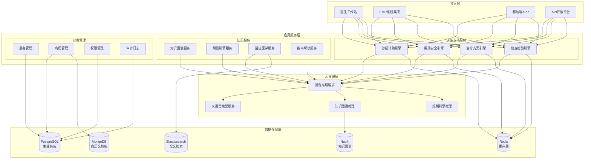
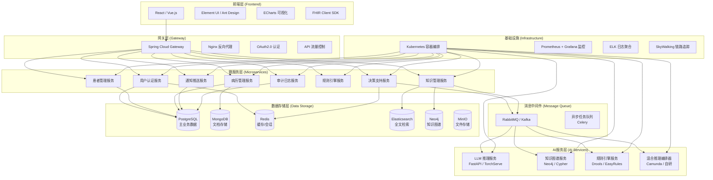
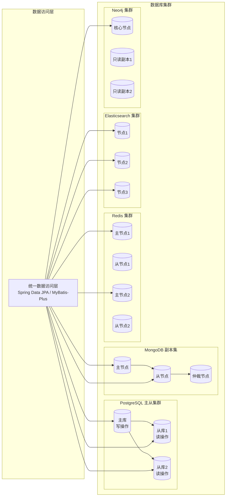
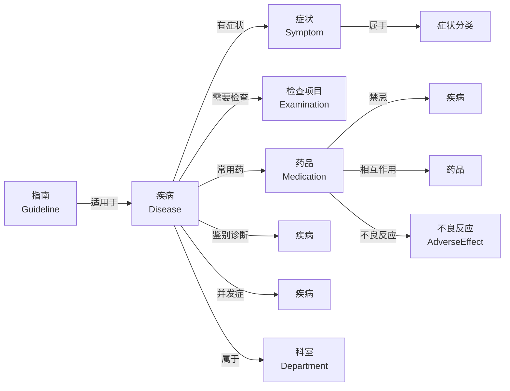
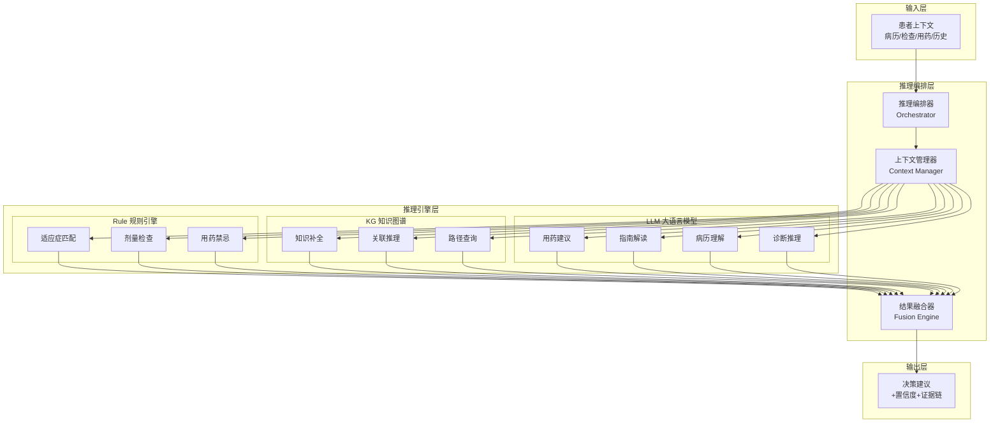
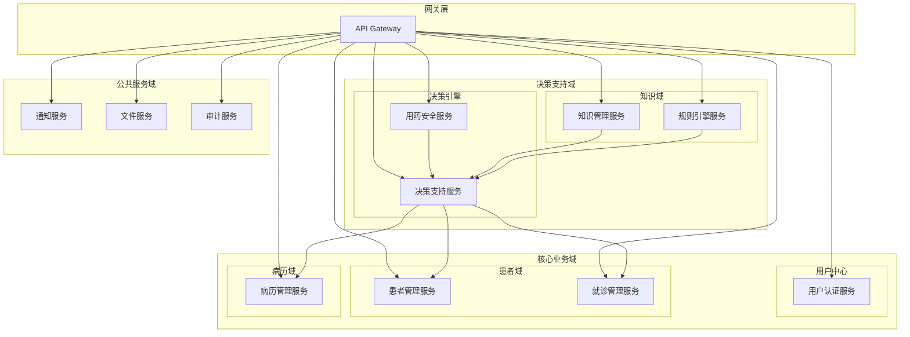
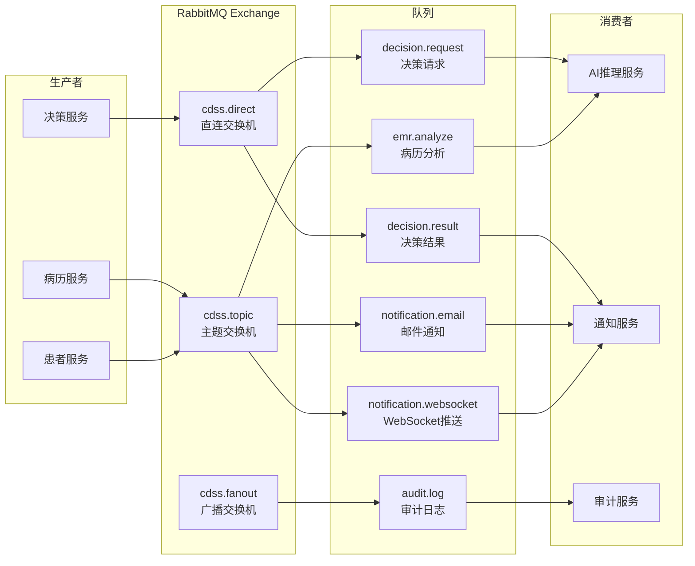
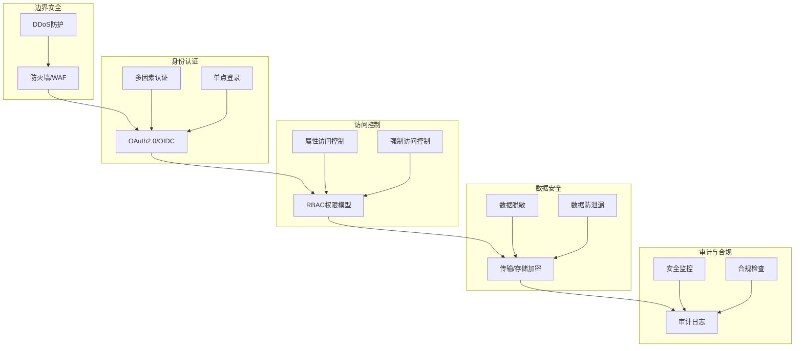
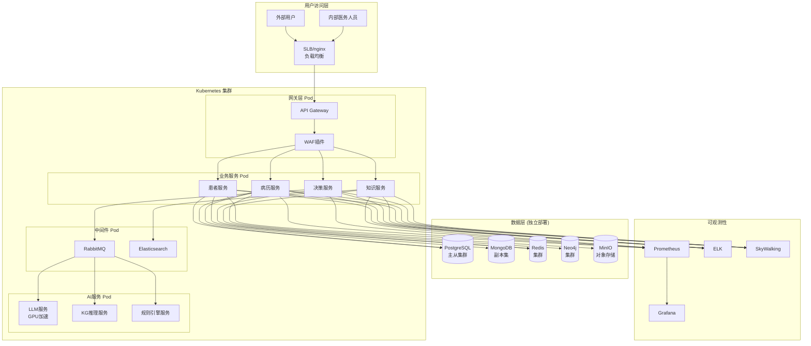

# 智慧医疗临床决策支持系统(CDSS)技术设计方案

**文档版本：** v1.0  
**编制日期：** 2026年5月  
**文档状态：** 正式版  
**保密等级：** 内部机密

---

## 目录

1. [系统概述](#1-系统概述)
2. [技术架构设计](#2-技术架构设计)
3. [技术栈选型](#3-技术栈选型)
4. [数据库设计](#4-数据库设计)
5. [AI混合推理引擎设计](#5-ai混合推理引擎设计)
6. [微服务架构设计](#6-微服务架构设计)
7. [接口设计规范](#7-接口设计规范)
8. [安全体系设计](#8-安全体系设计)
9. [部署架构设计](#9-部署架构设计)
10. [性能与可扩展性设计](#10-性能与可扩展性设计)

---

## 1. 系统概述

### 1.1 系统定位

临床决策支持系统（Clinical Decision Support System, CDSS）是智慧医疗的核心系统，基于人工智能、知识图谱和临床规则引擎，为医务人员提供实时、精准的临床决策辅助，包括：

- 诊断辅助建议
- 用药安全预警
- 治疗方案推荐
- 检查检验解读
- 循证医学证据检索
- 临床路径指引

### 1.2 设计目标

| 指标 | 目标值 | 说明 |
|------|--------|------|
| 系统可用性 | ≥99.9% | 支持7×24小时连续运行 |
| 决策响应时间 | ≤500ms | 常规决策请求端到端延迟 |
| 并发用户数 | ≥1000 | 同时在线医务人员数量 |
| 诊断准确率 | ≥95% | 常见病诊断辅助准确率 |
| 数据吞吐量 | ≥1000 TPS | 峰值业务处理能力 |

### 1.3 系统功能架构



---

## 2. 技术架构设计

### 2.1 总体技术架构



### 2.2 架构设计原则

1. **高内聚低耦合**：按业务域划分微服务边界，服务间通过标准化接口通信
2. **弹性设计**：支持熔断、降级、限流，确保核心功能在高负载下稳定运行
3. **数据一致性**：采用最终一致性模型，通过消息队列和分布式事务保障
4. **可观测性**：全链路监控、日志聚合、性能指标采集
5. **安全合规**：符合HIPAA、等保三级、医疗数据安全规范要求

---

## 3. 技术栈选型

### 3.1 后端技术栈

| 技术领域 | 选型方案 | 版本 | 选型理由 |
|---------|---------|------|---------|
| 开发语言 | Java JDK | 21 LTS | 长期支持版，性能优异，生态成熟 |
| 微服务框架 | Spring Boot | 3.2.x | 社区活跃，文档完善，快速开发 |
| 微服务治理 | Spring Cloud | 2023.0.x | 服务发现、配置中心、网关一体化 |
| 服务注册 | Nacos | 2.3.x | 阿里开源，支持服务发现+配置管理 |
| 配置中心 | Nacos | 2.3.x | 动态配置刷新，多环境隔离 |
| 服务网关 | Spring Cloud Gateway | 4.1.x | 响应式编程，高性能路由 |
| 声明式调用 | OpenFeign | 4.1.x | 简化HTTP调用，集成负载均衡 |
| 熔断降级 | Resilience4j | 2.2.x | 轻量级，函数式编程风格 |
| 分布式事务 | Seata | 1.8.x | 支持AT/TCC/SAGA模式 |

### 3.2 AI推理服务技术栈

| 技术领域 | 选型方案 | 版本 | 选型理由 |
|---------|---------|------|---------|
| 开发语言 | Python | 3.11.x | 机器学习生态最丰富 |
| Web框架 | FastAPI | 0.109.x | 高性能异步，自动生成OpenAPI |
| 模型推理 | PyTorch | 2.2.x | 动态计算图，研究生产一体化 |
| 模型服务 | TorchServe | 0.9.x | 模型版本管理，A/B测试支持 |
| 向量数据库 | Milvus | 2.3.x | 高性能向量检索，支持大规模RAG |
| LLM框架 | LangChain | 0.1.x | LLM应用编排，工具调用支持 |
| 规则引擎 | Drools | 8.44.x |  rete算法，复杂业务规则高效匹配 |

### 3.3 前端技术栈

| 技术领域 | 选型方案 | 版本 | 选型理由 |
|---------|---------|------|---------|
| 核心框架 | React / Vue.js | 18.x / 3.4.x | 双框架支持，团队灵活选择 |
| UI组件库 | Ant Design / Element Plus | 5.12.x / 2.5.x | 企业级组件，设计统一 |
| 状态管理 | Redux Toolkit / Pinia | 2.0.x / 2.1.x | 现代状态管理，DevTools支持 |
| 路由 | React Router / Vue Router | 6.21.x / 4.2.x | 官方路由，嵌套路由支持 |
| HTTP客户端 | Axios | 1.6.x | 拦截器、取消请求、超时控制 |
| 可视化 | ECharts | 5.4.x | 国产图表，丰富的医疗场景图表 |
| 构建工具 | Vite | 5.0.x | 极速开发体验，热更新快 |
| TypeScript | TypeScript | 5.3.x | 类型安全，大型项目可维护 |

### 3.4 DevOps技术栈

| 技术领域 | 选型方案 | 版本 |
|---------|---------|------|
| 容器化 | Docker | 24.0.x |
| 容器编排 | Kubernetes | 1.29.x |
| CI/CD | GitLab CI / Jenkins | 16.x / 2.43.x |
| 镜像仓库 | Harbor | 2.10.x |
| 监控告警 | Prometheus + Grafana | 2.48.x / 10.2.x |
| 日志系统 | ELK Stack | 8.12.x |
| 链路追踪 | Apache SkyWalking | 9.7.x |

---

## 4. 数据库设计

### 4.1 多数据库架构设计



### 4.2 PostgreSQL 主业务库设计

#### 4.2.1 核心表结构

**患者信息表 (t_patient)**

```sql
CREATE TABLE t_patient (
    patient_id      BIGSERIAL PRIMARY KEY,
    medical_record_no VARCHAR(50) UNIQUE NOT NULL,
    id_card_no      VARCHAR(18) NOT NULL,
    name            VARCHAR(100) NOT NULL,
    gender          SMALLINT NOT NULL, -- 1:男 2:女 9:未知
    birth_date      DATE NOT NULL,
    phone           VARCHAR(20),
    address         TEXT,
    blood_type      SMALLINT, -- 1:A 2:B 3:O 4:AB 9:未知
    marital_status  SMALLINT,
    occupation      VARCHAR(100),
    created_at      TIMESTAMP WITH TIME ZONE DEFAULT CURRENT_TIMESTAMP,
    updated_at      TIMESTAMP WITH TIME ZONE DEFAULT CURRENT_TIMESTAMP,
    created_by      BIGINT,
    updated_by      BIGINT,
    is_deleted      BOOLEAN DEFAULT FALSE
);

CREATE INDEX idx_patient_mrn ON t_patient(medical_record_no);
CREATE INDEX idx_patient_id_card ON t_patient(id_card_no);
CREATE INDEX idx_patient_name ON t_patient(name);
```

**就诊记录表 (t_encounter)**

```sql
CREATE TABLE t_encounter (
    encounter_id    BIGSERIAL PRIMARY KEY,
    patient_id      BIGINT NOT NULL REFERENCES t_patient(patient_id),
    encounter_type  SMALLINT NOT NULL, -- 1:门诊 2:住院 3:急诊 4:体检
    visit_no        VARCHAR(50) UNIQUE NOT NULL,
    department_id   BIGINT,
    doctor_id       BIGINT,
    chief_complaint TEXT, -- 主诉
    admission_time  TIMESTAMP WITH TIME ZONE,
    discharge_time  TIMESTAMP WITH TIME ZONE,
    discharge_diagnosis TEXT,
    status          SMALLINT NOT NULL, -- 1:进行中 2:已结束 3:已取消
    created_at      TIMESTAMP WITH TIME ZONE DEFAULT CURRENT_TIMESTAMP,
    updated_at      TIMESTAMP WITH TIME ZONE DEFAULT CURRENT_TIMESTAMP,
    is_deleted      BOOLEAN DEFAULT FALSE
);

CREATE INDEX idx_encounter_patient ON t_encounter(patient_id);
CREATE INDEX idx_encounter_visit ON t_encounter(visit_no);
CREATE INDEX idx_encounter_time ON t_encounter(admission_time);
```

**诊断记录表 (t_diagnosis)**

```sql
CREATE TABLE t_diagnosis (
    diagnosis_id    BIGSERIAL PRIMARY KEY,
    encounter_id    BIGINT NOT NULL REFERENCES t_encounter(encounter_id),
    patient_id      BIGINT NOT NULL,
    diagnosis_type  SMALLINT NOT NULL, -- 1:初步诊断 2:最终诊断 3:鉴别诊断
    icd10_code      VARCHAR(20),
    icd10_name      VARCHAR(200),
    diagnosis_desc  TEXT,
    diagnosis_time  TIMESTAMP WITH TIME ZONE,
    doctor_id       BIGINT,
    confidence      DECIMAL(5,2), -- 诊断置信度
    source_type     SMALLINT, -- 1:医生录入 2:AI辅助 3:混合
    is_confirmed    BOOLEAN DEFAULT FALSE,
    created_at      TIMESTAMP WITH TIME ZONE DEFAULT CURRENT_TIMESTAMP
);

CREATE INDEX idx_diagnosis_encounter ON t_diagnosis(encounter_id);
CREATE INDEX idx_diagnosis_icd10 ON t_diagnosis(icd10_code);
```

**用药记录表 (t_medication)**

```sql
CREATE TABLE t_medication (
    medication_id   BIGSERIAL PRIMARY KEY,
    encounter_id    BIGINT NOT NULL,
    patient_id      BIGINT NOT NULL,
    drug_code       VARCHAR(50),
    drug_name       VARCHAR(200) NOT NULL,
    specification   VARCHAR(100),
    dosage          DECIMAL(10,2),
    dosage_unit     VARCHAR(20),
    frequency       VARCHAR(50),
    route           VARCHAR(50), -- 给药途径
    start_time      TIMESTAMP WITH TIME ZONE,
    end_time        TIMESTAMP WITH TIME ZONE,
    doctor_id       BIGINT,
    pharmacist_id   BIGINT,
    status          SMALLINT, -- 1:开立 2:审核 3:执行 4:停止 5:完成
    warnings        JSONB, -- 用药警告信息
    created_at      TIMESTAMP WITH TIME ZONE DEFAULT CURRENT_TIMESTAMP
);

CREATE INDEX idx_medication_encounter ON t_medication(encounter_id);
CREATE INDEX idx_medication_patient ON t_medication(patient_id);
CREATE INDEX idx_medication_drug ON t_medication(drug_code);
```

**决策建议表 (t_decision_suggestion)**

```sql
CREATE TABLE t_decision_suggestion (
    suggestion_id   BIGSERIAL PRIMARY KEY,
    encounter_id    BIGINT NOT NULL,
    patient_id      BIGINT NOT NULL,
    suggestion_type SMALLINT NOT NULL, -- 1:诊断 2:用药 3:检查 4:治疗
    title           VARCHAR(200) NOT NULL,
    content         TEXT NOT NULL,
    evidence        JSONB, -- 循证依据
    confidence      DECIMAL(5,2),
    source          VARCHAR(50), -- LLM KG RULE HYBRID
    priority        SMALLINT, -- 1:高危 2:重要 3:提示 4:信息
    is_accepted     BOOLEAN,
    accepted_by     BIGINT,
    accepted_time   TIMESTAMP WITH TIME ZONE,
    created_at      TIMESTAMP WITH TIME ZONE DEFAULT CURRENT_TIMESTAMP
);

CREATE INDEX idx_suggestion_encounter ON t_decision_suggestion(encounter_id);
CREATE INDEX idx_suggestion_type ON t_decision_suggestion(suggestion_type);
CREATE INDEX idx_suggestion_priority ON t_decision_suggestion(priority);
```

### 4.3 MongoDB 病历文档库设计

#### 4.3.1 病历文档集合设计

```javascript
// 电子病历文档集合 (emr_documents)
{
  "_id": ObjectId,
  "patientId": NumberLong,
  "encounterId": NumberLong,
  "documentType": String, // 门诊病历/住院病历/病程记录/手术记录
  "title": String,
  "content": {
    "sections": [
      {
        "sectionType": String, // 主诉/现病史/既往史/体格检查
        "sectionTitle": String,
        "content": String,
        "structuredData": Object // 结构化提取结果
      }
    ],
    "rawText": String,
    "html": String
  },
  "author": {
    "doctorId": NumberLong,
    "doctorName": String,
    "department": String
  },
  "signed": Boolean,
  "signedAt": ISODate,
  "version": NumberInt,
  "auditTrail": [
    {
      "action": String,
      "userId": NumberLong,
      "timestamp": ISODate,
      "changeSummary": String
    }
  ],
  "createdAt": ISODate,
  "updatedAt": ISODate,
  "indexedForSearch": Boolean,
  "nlpProcessed": Boolean // 是否已NLP处理
}

// 索引
db.emr_documents.createIndex({ patientId: 1, encounterId: 1 });
db.emr_documents.createIndex({ "content.rawText": "text" });
db.emr_documents.createIndex({ documentType: 1, createdAt: -1 });
```

### 4.4 Redis 缓存设计

| 缓存类型 | Key 模式 | TTL | 说明 |
|---------|---------|-----|------|
| 用户会话 | `session:{userId}` | 2h | 登录态管理 |
| 患者信息 | `patient:{mrn}` | 24h | 患者基本信息缓存 |
| 字典数据 | `dict:{type}` | 7d | 药品、诊断、科室等字典 |
| 热点数据 | `hot:{key}` | 1h | 高频访问数据 |
| 分布式锁 | `lock:{resource}` | 30s | 防止并发操作 |
| 限流器 | `rate:{user}:{api}` | 1min | API访问限流 |
| 决策缓存 | `decision:{encounterId}` | 1h | 决策建议结果缓存 |

### 4.5 Elasticsearch 检索设计

#### 4.5.1 索引设计

**医学知识索引 (medical_knowledge)**

```json
{
  "settings": {
    "number_of_shards": 5,
    "number_of_replicas": 1,
    "analysis": {
      "analyzer": {
        "medical_analyzer": {
          "tokenizer": "ik_max_word",
          "filter": ["synonym_filter"]
        }
      }
    }
  },
  "mappings": {
    "properties": {
      "knowledgeType": {"type": "keyword"}, // 指南/药品/疾病/检查
      "title": {"type": "text", "analyzer": "medical_analyzer"},
      "content": {"type": "text", "analyzer": "medical_analyzer"},
      "keywords": {"type": "keyword"},
      "icd10Codes": {"type": "keyword"},
      "drugCodes": {"type": "keyword"},
      "source": {"type": "keyword"},
      "level": {"type": "integer"}, // 证据等级
      "publishDate": {"type": "date"},
      "embedding": {"type": "dense_vector", "dims": 1536}
    }
  }
}
```

### 4.6 Neo4j 知识图谱设计

#### 4.6.1 实体-关系模型



#### 4.6.2 Cypher 约束创建

```cypher
// 创建唯一约束
CREATE CONSTRAINT unique_disease_code FOR (d:Disease) REQUIRE d.code IS UNIQUE;
CREATE CONSTRAINT unique_drug_code FOR (m:Medication) REQUIRE m.code IS UNIQUE;
CREATE CONSTRAINT unique_symptom_code FOR (s:Symptom) REQUIRE s.code IS UNIQUE;

// 创建索引
CREATE INDEX FOR (d:Disease) ON (d.name);
CREATE INDEX FOR (m:Medication) ON (m.name);
CREATE INDEX FOR (s:Symptom) ON (s.name);
```

---

## 5. AI混合推理引擎设计

### 5.1 混合推理架构



### 5.2 核心组件设计

#### 5.2.1 混合推理编排器

```java
@Service
public class HybridInferenceOrchestrator {
    
    @Autowired
    private LLMService llmService;
    
    @Autowired
    private KnowledgeGraphService kgService;
    
    @Autowired
    private RuleEngineService ruleService;
    
    @Autowired
    private ResultFusionService fusionService;
    
    public DecisionResult executeInference(PatientContext context, 
                                          InferenceType type) {
        // 1. 上下文准备与增强
        PatientContext enrichedContext = prepareContext(context);
        
        // 2. 并行执行多引擎推理
        CompletableFuture<LLMResult> llmFuture = 
            CompletableFuture.supplyAsync(() -> 
                llmService.infer(enrichedContext, type));
                
        CompletableFuture<KGResult> kgFuture = 
            CompletableFuture.supplyAsync(() -> 
                kgService.reason(enrichedContext, type));
                
        CompletableFuture<RuleResult> ruleFuture = 
            CompletableFuture.supplyAsync(() -> 
                ruleService.execute(enrichedContext, type));
        
        // 3. 等待所有推理完成
        CompletableFuture.allOf(llmFuture, kgFuture, ruleFuture).join();
        
        // 4. 结果融合与排序
        DecisionResult result = fusionService.fuse(
            llmFuture.join(), 
            kgFuture.join(), 
            ruleFuture.join(),
            type
        );
        
        // 5. 置信度校准
        result = calibrateConfidence(result, context);
        
        // 6. 证据链生成
        result = generateEvidenceChain(result, context);
        
        return result;
    }
}
```

### 5.3 大语言模型推理设计

#### 5.3.1 Prompt 工程架构

```python
class CDSSPromptManager:
    def __init__(self):
        self.templates = {
            'diagnosis': self._get_diagnosis_template(),
            'medication': self._get_medication_template(),
            'examination': self._get_examination_template(),
            'interpretation': self._get_interpretation_template()
        }
    
    def build_prompt(self, prompt_type, patient_context, knowledge_context):
        template = self.templates[prompt_type]
        
        # 构建结构化Prompt
        prompt = template.format(
            patient_profile=patient_context.get_profile(),
            chief_complaint=patient_context.get_chief_complaint(),
            medical_history=patient_context.get_medical_history(),
            examination_results=patient_context.get_examination_results(),
            current_medications=patient_context.get_medications(),
            knowledge_context=knowledge_context,
            output_format=self._get_output_format(prompt_type)
        )
        
        return prompt
    
    def _get_diagnosis_template(self) -> str:
        return """
# 角色
你是一名经验丰富的临床医生，拥有20年的内科临床经验。

# 任务
基于以下患者信息，提供诊断辅助建议。

# 患者信息
## 基本信息
{patient_profile}

## 主诉
{chief_complaint}

## 现病史与既往史
{medical_history}

## 检查检验结果
{examination_results}

## 当前用药
{current_medications}

# 参考知识
{knowledge_context}

# 输出要求
{output_format}

请按照JSON格式输出诊断建议：
"""
```

### 5.4 规则引擎设计

#### 5.4.1 Drools 用药禁忌规则示例

```java
// 用药禁忌规则定义
rule "DrugContraindication_Disease"
    dialect "java"
    when
        $patient: Patient()
        $medication: Medication()
        $diagnosis: Diagnosis() from accumulate(
            Diagnosis(patientId == $patient.getPatientId(), 
                      icd10Code in $medication.getContraindicationCodes()),
            count(1) > 0
        )
    then
        Warning warning = new Warning();
        warning.setLevel(WarningLevel.CRITICAL);
        warning.setType(WarningType.DRUG_CONTRAINDICATION);
        warning.setTitle("用药禁忌预警");
        warning.setMessage(String.format(
            "患者诊断[%s]与药品[%s]存在禁忌关系",
            $diagnosis.getIcd10Name(),
            $medication.getDrugName()
        ));
        insert(warning);
end

rule "DrugInteraction"
    no-loop true
    when
        $med1: Medication($drugCode1: drugCode)
        $med2: Medication(drugCode == getInteractionDrug($drugCode1),
                         this != $med1)
        $interaction: DrugInteraction(
            drugCode1 == $drugCode1,
            drugCode2 == $med2.getDrugCode()
        )
    then
        Warning warning = new Warning();
        warning.setLevel(WarningLevel.WARNING);
        warning.setType(WarningType.DRUG_INTERACTION);
        warning.setTitle("药物相互作用预警");
        warning.setMessage(String.format(
            "[%s]与[%s]存在%s相互作用: %s",
            $med1.getDrugName(),
            $med2.getDrugName(),
            $interaction.getSeverity(),
            $interaction.getDescription()
        ));
        insert(warning);
end
```

### 5.5 结果融合算法

```python
class ResultFusionEngine:
    def __init__(self):
        self.weights = {
            'diagnosis': {'llm': 0.5, 'kg': 0.3, 'rule': 0.2},
            'medication': {'llm': 0.3, 'kg': 0.3, 'rule': 0.4},
            'examination': {'llm': 0.4, 'kg': 0.4, 'rule': 0.2}
        }
    
    def fuse(self, llm_result, kg_result, rule_result, decision_type):
        weights = self.weights[decision_type]
        
        # 1. 结果对齐
        aligned_results = self._align_results(
            llm_result, kg_result, rule_result
        )
        
        # 2. 加权融合
        fused_suggestions = []
        for item in aligned_results:
            # 计算加权置信度
            weighted_confidence = (
                item['llm_confidence'] * weights['llm'] +
                item['kg_confidence'] * weights['kg'] +
                item['rule_confidence'] * weights['rule']
            )
            
            # 证据链整合
            evidence_chain = self._merge_evidence(item)
            
            # 优先级调整
            priority = self._adjust_priority(item, weighted_confidence)
            
            fused_suggestions.append({
                'title': item['title'],
                'content': item['content'],
                'confidence': weighted_confidence,
                'priority': priority,
                'evidence_chain': evidence_chain,
                'sources': item['sources']
            })
        
        # 3. 排序与去重
        fused_suggestions.sort(
            key=lambda x: (-x['priority'], -x['confidence'])
        )
        
        return {
            'suggestions': fused_suggestions,
            'fusion_meta': {
                'weights_used': weights,
                'total_suggestions': len(fused_suggestions),
                'timestamp': datetime.now().isoformat()
            }
        }
```

---

## 6. 微服务架构设计

### 6.1 服务划分与边界



### 6.2 核心微服务设计

#### 6.2.1 决策支持服务 (Decision-Support-Service)

**服务职责：**
- 接收决策请求，触发推理流程
- 管理决策上下文生命周期
- 调用AI推理服务
- 结果缓存与复用
- 决策建议持久化

**核心接口：**

```java
@RestController
@RequestMapping("/api/v1/decisions")
public class DecisionController {
    
    @PostMapping("/diagnosis")
    @Operation(summary = "获取诊断建议")
    public ApiResponse<DecisionResult> getDiagnosisSuggestions(
        @RequestBody DiagnosisRequest request) {
        return decisionService.getDiagnosisSuggestions(request);
    }
    
    @PostMapping("/medication")
    @Operation(summary = "获取用药建议与安全检查")
    public ApiResponse<MedicationResult> getMedicationSuggestions(
        @RequestBody MedicationRequest request) {
        return decisionService.getMedicationSuggestions(request);
    }
    
    @PostMapping("/examination")
    @Operation(summary = "检查检验结果解读")
    public ApiResponse<InterpretationResult> interpretExamination(
        @RequestBody InterpretationRequest request) {
        return decisionService.interpretExamination(request);
    }
    
    @PostMapping("/treatment")
    @Operation(summary = "获取治疗方案建议")
    public ApiResponse<TreatmentResult> getTreatmentPlan(
        @RequestBody TreatmentRequest request) {
        return decisionService.getTreatmentPlan(request);
    }
    
    @GetMapping("/{encounterId}")
    @Operation(summary = "获取就诊的所有决策建议")
    public ApiResponse<List<DecisionSuggestion>> getEncounterDecisions(
        @PathVariable Long encounterId) {
        return decisionService.getEncounterDecisions(encounterId);
    }
    
    @PutMapping("/suggestions/{suggestionId}/accept")
    @Operation(summary = "采纳决策建议")
    public ApiResponse<Void> acceptSuggestion(
        @PathVariable Long suggestionId) {
        decisionService.acceptSuggestion(suggestionId);
        return ApiResponse.success();
    }
}
```

#### 6.2.2 知识管理服务 (Knowledge-Management-Service)

**服务职责：**
- 医学知识图谱维护
- 临床规则管理
- 循证医学知识库维护
- 知识版本管理
- 知识质量评估

**核心领域模型：**

```java
// 知识实体基类
@MappedSuperclass
public abstract class MedicalKnowledge {
    @Id
    @GeneratedValue(strategy = GenerationType.IDENTITY)
    private Long id;
    
    private String code;
    private String name;
    
    @Enumerated(EnumType.STRING)
    private KnowledgeType type;
    
    @Column(columnDefinition = "TEXT")
    private String description;
    
    @Enumerated(EnumType.STRING)
    private EvidenceLevel evidenceLevel;
    
    private String source;
    private LocalDate publishDate;
    private String version;
    
    @Enumerated(EnumType.STRING)
    private KnowledgeStatus status;
}

// 疾病实体
@Entity
@Table(name = "t_knowledge_disease")
public class Disease extends MedicalKnowledge {
    private String icd10Code;
    private String icd10Name;
    
    @ElementCollection
    private List<String> synonyms;
    
    @ElementCollection
    private List<String> typicalSymptoms;
    
    @ElementCollection
    private List<String> differentialDiagnoses;
    
    @Column(columnDefinition = "JSONB")
    private DiseasePathogenesis pathogenesis;
}

// 药品实体
@Entity
@Table(name = "t_knowledge_drug")
public class Drug extends MedicalKnowledge {
    private String atcCode;
    private String specification;
    private String dosageForm;
    private String manufacturer;
    
    @ElementCollection
    private List<String> indications;
    
    @ElementCollection
    private List<String> contraindications;
    
    @Column(columnDefinition = "JSONB")
    private DosageGuidance dosageGuidance;
    
    @ElementCollection
    private List<String> adverseReactions;
}
```

---

## 7. 接口设计规范

### 7.1 RESTful API 设计规范

#### 7.1.1 统一响应格式

```json
{
  "code": 200,
  "message": "success",
  "requestId": "req_20240506120000_abc123",
  "timestamp": 1715000000000,
  "data": {
    // 业务数据
  },
  "pagination": {
    "page": 1,
    "size": 20,
    "total": 100,
    "totalPages": 5
  }
}
```

#### 7.1.2 错误码规范

| 错误码区间 | 含义 | 示例 |
|-----------|------|------|
| 200 | 成功 | 200 - OK |
| 400xxx | 请求错误 | 400001 - 参数校验失败 |
| 401xxx | 认证错误 | 401001 - Token过期 |
| 403xxx | 权限错误 | 403001 - 无访问权限 |
| 404xxx | 资源不存在 | 404001 - 患者不存在 |
| 500xxx | 系统错误 | 500001 - 内部服务错误 |
| 503xxx | 服务不可用 | 503001 - AI服务暂时不可用 |

### 7.2 FHIR 标准接口设计

#### 7.2.1 FHIR 资源映射

| FHIR 资源 | 业务实体 | 端点 |
|-----------|---------|------|
| Patient | 患者信息 | `/fhir/r4/Patient` |
| Encounter | 就诊记录 | `/fhir/r4/Encounter` |
| Condition | 诊断记录 | `/fhir/r4/Condition` |
| MedicationRequest | 用药医嘱 | `/fhir/r4/MedicationRequest` |
| Observation | 检查检验 | `/fhir/r4/Observation` |
| DiagnosticReport | 诊断报告 | `/fhir/r4/DiagnosticReport` |
| Procedure | 手术/操作 | `/fhir/r4/Procedure` |

#### 7.2.2 FHIR Patient 资源示例

```json
{
  "resourceType": "Patient",
  "id": "pat-00001",
  "identifier": [
    {
      "system": "http://hospital.org/medical-record-number",
      "value": "MR20240506001"
    },
    {
      "system": "http://hl7.org/fhir/sid/us-ssn",
      "value": "110101199001011234"
    }
  ],
  "name": [
    {
      "family": "张",
      "given": ["三"],
      "text": "张三"
    }
  ],
  "gender": "male",
  "birthDate": "1990-01-01",
  "telecom": [
    {
      "system": "phone",
      "value": "13800138000",
      "use": "mobile"
    }
  ],
  "address": [
    {
      "line": ["XX街道XX号"],
      "city": "北京市",
      "state": "北京",
      "postalCode": "100000",
      "country": "CN"
    }
  ],
  "maritalStatus": {
    "coding": [
      {
        "system": "http://terminology.hl7.org/CodeSystem/v3-MaritalStatus",
        "code": "M",
        "display": "Married"
      }
    ]
  }
}
```

### 7.3 异步消息接口设计

#### 7.3.1 消息队列拓扑



#### 7.3.2 消息格式规范

```json
{
  "messageId": "msg_20240506120000_xyz789",
  "messageType": "DECISION_REQUEST",
  "source": "decision-service",
  "timestamp": 1715000000000,
  "version": "1.0",
  "payload": {
    "requestId": "req_abc123",
    "encounterId": 10001,
    "patientId": 20001,
    "decisionType": "DIAGNOSIS",
    "context": {
      // 决策上下文数据
    }
  },
  "traceContext": {
    "traceId": "trace-abc123",
    "spanId": "span-xyz789"
  },
  "retryCount": 0,
  "priority": "NORMAL"
}
```

---

## 8. 安全体系设计

### 8.1 整体安全架构



### 8.2 身份认证与授权

#### 8.2.1 OAuth2.0 + JWT 认证流程

```java
@Configuration
@EnableWebSecurity
public class SecurityConfig {
    
    @Bean
    public SecurityFilterChain securityFilterChain(HttpSecurity http) {
        http
            .authorizeHttpRequests(auth -> auth
                .requestMatchers("/api/auth/**").permitAll()
                .requestMatchers("/api/public/**").permitAll()
                .requestMatchers("/api/admin/**").hasRole("ADMIN")
                .requestMatchers("/api/doctor/**").hasAnyRole("DOCTOR", "ADMIN")
                .requestMatchers("/api/pharmacist/**").hasAnyRole("PHARMACIST", "ADMIN")
                .anyRequest().authenticated()
            )
            .oauth2ResourceServer(oauth2 -> oauth2
                .jwt(Customizer.withDefaults())
            )
            .sessionManagement(session -> session
                .sessionCreationPolicy(SessionCreationPolicy.STATELESS)
            );
        
        return http.build();
    }
}
```

### 8.3 数据加密设计

#### 8.3.1 字段级加密

```java
@Converter
public class EncryptedAttributeConverter 
    implements AttributeConverter<String, String> {
    
    private final AES256Encryptor encryptor;
    
    @Override
    public String convertToDatabaseColumn(String attribute) {
        if (attribute == null) {
            return null;
        }
        return encryptor.encrypt(attribute);
    }
    
    @Override
    public String convertToEntityAttribute(String dbData) {
        if (dbData == null) {
            return null;
        }
        return encryptor.decrypt(dbData);
    }
}

// 实体使用
@Entity
public class Patient {
    @Id
    private Long patientId;
    
    @Convert(converter = EncryptedAttributeConverter.class)
    private String idCardNo;
    
    @Convert(converter = EncryptedAttributeConverter.class)
    private String phone;
    
    @Convert(converter = EncryptedAttributeConverter.class)
    private String address;
}
```

### 8.4 审计日志设计

#### 8.4.1 审计日志模型

```sql
CREATE TABLE t_audit_log (
    audit_id        BIGSERIAL PRIMARY KEY,
    trace_id        VARCHAR(100),
    user_id         BIGINT,
    user_name       VARCHAR(100),
    user_ip         VARCHAR(50),
    operation_type  VARCHAR(50) NOT NULL, -- CREATE READ UPDATE DELETE LOGIN
    resource_type   VARCHAR(50) NOT NULL, -- PATIENT ENCOUNTER MEDICATION DECISION
    resource_id     VARCHAR(100),
    operation_desc  TEXT,
    request_params  JSONB,
    response_data   JSONB,
    operation_time  TIMESTAMP WITH TIME ZONE DEFAULT CURRENT_TIMESTAMP,
    duration_ms     INTEGER,
    success         BOOLEAN,
    error_message   TEXT,
    sensitivity_level SMALLINT -- 1:普通 2:敏感 3:高度敏感
);

CREATE INDEX idx_audit_user ON t_audit_log(user_id);
CREATE INDEX idx_audit_time ON t_audit_log(operation_time);
CREATE INDEX idx_audit_resource ON t_audit_log(resource_type, resource_id);
```

---

## 9. 部署架构设计

### 9.1 生产环境部署拓扑



### 9.2 高可用设计

| 组件 | 高可用方案 | RPO | RTO |
|-----|-----------|-----|-----|
| PostgreSQL | 一主两从 + 流复制 + Pgpool | ≤5s | ≤30s |
| MongoDB | 三节点副本集 | ≤5s | ≤10s |
| Redis | 集群模式 + 哨兵 | ≤1s | ≤5s |
| Elasticsearch | 三节点集群 + 副本分片 | ≤5s | ≤10s |
| Neo4j | 因果集群 | ≤10s | ≤30s |
| 应用服务 | K8s 多副本部署 + HPA | 0 | ≤10s |

### 9.3 容灾设计

- **同城双活**：主数据中心 + 同城灾备中心，RPO<1分钟，RTO<30分钟
- **异地灾备**：异地冷备，RPO<15分钟，RTO<4小时
- **数据备份策略**：全量备份(每日) + 增量备份(每小时) + WAL归档(实时)

---

## 10. 性能与可扩展性设计

### 10.1 性能指标

| 指标 | 目标值 | 测量方式 |
|-----|--------|---------|
| API响应时间 | P95 < 200ms | Prometheus histogram |
| 决策推理时间 | P95 < 500ms | 埋点计时 |
| 数据库查询 | P95 < 50ms | 慢查询日志 |
| 并发用户数 | ≥1000 | 压测验证 |
| TPS | ≥1000 | 压测验证 |
| 系统可用性 | ≥99.9% | 监控统计 |

### 10.2 性能优化策略

1. **数据库优化**
   - 读写分离，主库写，从库读
   - 索引优化，覆盖索引
   - SQL审核，避免全表扫描
   - 分库分表，垂直+水平拆分

2. **缓存优化**
   - 多级缓存：本地缓存 + 分布式缓存
   - 热点数据预加载
   - 缓存穿透/击穿/雪崩防护

3. **异步化**
   - 非核心操作异步处理
   - 消息队列削峰填谷
   - 事件驱动架构

4. **AI推理优化**
   - 模型量化(FP16/INT8)
   - 批量推理(Batching)
   - 推理结果缓存
   - GPU资源池化

### 10.3 可扩展性设计

1. **水平扩展**
   - 无状态服务K8s HPA自动扩缩
   - 数据库分库分表支持线性扩展
   - AI推理服务独立扩缩

2. **模块化设计**
   - 插件化架构，功能可插拔
   - 标准化接口，便于集成
   - 领域驱动设计，边界清晰

3. **技术兼容性**
   - 支持多种大模型接入
   - 兼容主流EMR/HIS系统
   - 标准FHIR接口

---

## 附录

### A. 参考标准与规范

1. HL7 FHIR R4 标准
2. DICOM 医学影像标准
3. ICD-10 疾病编码标准
4. ATC 药品分类编码
5. HIPAA 医疗隐私安全法案
6. 网络安全等级保护2.0三级要求
7. GB/T 25000 系统与软件质量模型

### B. 开源组件许可

本方案采用的开源组件均遵循商业友好的开源许可(Apache 2.0, MIT, BSD等)。

### C. 文档变更记录

| 版本 | 日期 | 变更内容 | 变更人 |
|------|------|---------|--------|
| v1.0 | 2026-05-06 | 初始版本，完整技术设计方案 | 技术专家组 |

---

**文档结束**
